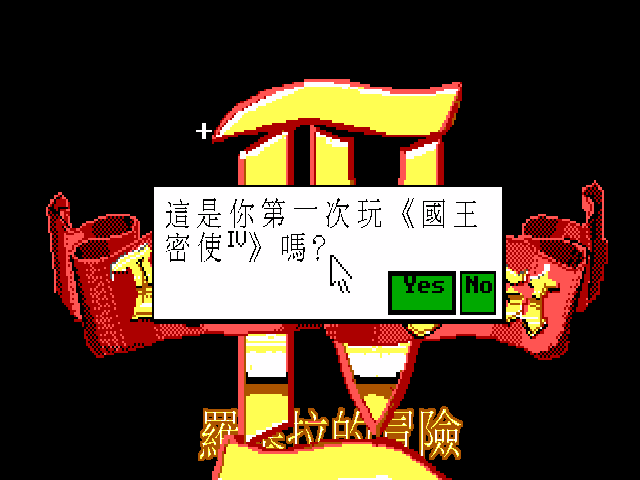
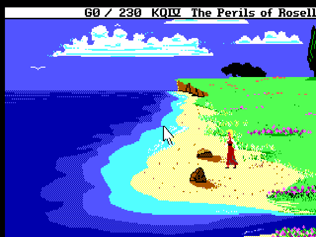

# 國王密使 IV：羅塞拉的冒險 — 繁體中文化

> King's Quest IV: The Perils of Rosella（1988, Sierra On-Line）SCI0 EGA 版
> ScummVM 繁體中文化 · patch-only

還記得嗎？那個年代，遊戲盒子裡總附一本厚厚的說明書，書局架上的油墨都還沒乾。我們捧著智冠、軟體世界翻譯的《國王密使》手冊，一個字一個字對著螢幕上的英文猜——猜羅塞拉要去哪、猜那顆藥草在哪座山。三十多年過去，這一次，羅塞拉終於用中文開口了。

---

## 一封遲到的中文版

1988 年，Sierra 用一套全新的引擎 **SCI（Sierra Creative Interpreter）** 推出了《國王密使 IV》。它是 Sierra 第一款 SCI 遊戲，畫面比舊的 AGI 細膩、音樂第一次請來好萊塢作曲家 William Goldstein 譜寫、還內建了當年音色最頂的 **Roland MT-32** 支援。更重要的是——它讓 **Sierra 冒險遊戲的第一位女主角**，卡拉漢國王的女兒**羅塞拉公主**，走進了聚光燈。

當年那本智冠／軟體世界的中文說明書，連稱呼玩家都特意寫成「**你（妳）**」——因為這一次，操縱冒險的是一位少女。

本專案把這款經典**全部的遊戲文字**繁體中文化，跑在現代 ScummVM 上，畫面放大到 640×400、中文以 hi-res Big5 字模直繪，筆畫銳利。譯名一律承襲當年智冠／軟體世界的定名，玩起來就是記憶裡那一版。

## 故事：只有一天一夜

> 「羅塞拉，我能做的事情不多了，我將會衰弱到無法飛回家……你只有一天的時間來完成這些事情，運用你的智慧及敏捷的身手吧！否則，將終其一生陷在這陌生的國度而束手無策。」
> ——仙女吉妮絲，智冠中文說明書

年邁的**卡拉漢國王**在王座廳前倒下，生命垂危。哀傷的羅塞拉對著魔鏡哭泣，鏡中浮現善良的仙女**吉妮絲（Genesta）**：她的魔法護身符被邪惡的仙女**樂樂蒂（Lolotte）**偷走，法力正一點一點消失，撐不過 24 小時。

吉妮絲把羅塞拉帶到遙遠的奇幻大陸**塔米亞（Tamir）**，只給了她一身農家女孩的偽裝、和兩個任務：**取回護身符**救吉妮絲，**找到百年一結的魔法果實**救父王——而樂樂蒂的城堡，就矗立在高山之上，俯視著整片塔米亞。

一日之內，海灘、森林、墓園、鬧鬼老宅、矮人礦坑、獨角獸、食人魔、還有那座陰森的仙女城堡……羅塞拉的冒險，從她獨自醒來的那片海灘開始。

## 畫面

| 中文開場敘述 | 中文防拷驗證 |
|---|---|
|  |  |
| 王座廳，卡拉漢國王傳承冒險者之帽 | 防拷已附萬用通關碼 `BOBALU` |

| 中文標題 | 塔米亞海灘 |
|---|---|
|  |  |
| 經典紅金 logo 下並存中文副標 | 羅塞拉漂流至此，一日冒險就此展開 |

## 特色

- **權威譯名**：人名地名採當年智冠／軟體世界中文說明書定名——羅塞拉、卡拉漢國王、蘭妮絲王后、仙女吉妮絲、反派樂樂蒂、塔米亞、達文奇。玩起來就是記憶中那一版。
- **童話奇幻語感**：敘述流暢帶古典童話質感，對白自然口語、各角色語氣分明——羅塞拉的善良勇敢、吉妮絲的溫柔、樂樂蒂的陰狠，都在字裡行間。
- **hi-res 銳利中文**：640×400 直繪，遠看近看都清楚，不是把 320×200 硬放大的馬賽克。
- **中文標題**：經典的「King's Quest」紅金 logo 完整保留，下方並存中文「羅塞拉的冒險」副標。
- **防拷友善**：KQ4 開場要翻手冊答題——三十年前逼你翻書的那道關卡。中文版提示已附上萬用通關碼 **`BOBALU`**，任何問題直接輸入即可通過，不必再翻箱倒櫃找手冊。
- **原汁原味的音樂**：老 Sierra 為 MT-32 譜曲，自備 ROM 即可聽到 William Goldstein 當年的配樂（見下）。
- **完整覆蓋**：主線對白、旁白敘述、parser 回應、道具互動、選單、credits、暫停畫面全中文（狀態列分數列因引擎字型限制保留英文）。

## 安裝與遊玩

需要：
1. 一份《King's Quest IV》**SCI 版**遊戲檔（含 `RESOURCE.MAP` / `RESOURCE.001`~`009`）。⚠ 此遊戲當年同時發行 AGI 與 SCI 兩版，本中文化針對 **SCI 版**。
2. 套用本專案的 ScummVM 引擎 patch（見 [`BUILD.md`](BUILD.md)），或使用完整包（若有提供）。

步驟（簡述，詳見 BUILD.md）：
1. 取乾淨 ScummVM 原始碼（pinned commit 見 `patches/UPSTREAM_COMMIT.txt`），套 `patches/0001-sci-cht-zh_twn.patch` + 複製 `patches/fontchinese.{h,cpp}`，編譯。
2. 把 `dist-cht/` 的 `translation.tsv`、`qfg1_big5.fnt`、`qfg1_big5_hi.fnt`、`kq4_title.ovl` 放進遊戲資料夾。
3. 在 ScummVM 加入遊戲，語言設為 `Chinese (Traditional)`（或 CLI `--language=tw`）啟動。

### 防拷通關

開場會出現「請翻閱手冊回答問題」的驗證框。中文版提示已寫明：**直接輸入 `BOBALU` 按 Enter 即可通過**（大小寫皆可）。

### Roland MT-32 音樂（建議）

老 Sierra 遊戲為 MT-32 譜曲，音色遠勝 AdLib。自備 MT-32 ROM（`MT32_CONTROL.ROM` + `MT32_PCM.ROM`）放進遊戲資料夾，音效選項選 Roland MT-32 即可。（ROM 有版權，不隨本專案發佈。）

## 中文手冊要點索引

當年智冠／軟體世界中文說明書的重點整理見 [`docs/manual-cht.md`](docs/manual-cht.md)：

- **背景故事**：達文奇王國的傳承、三大寶物、卡拉漢與蘭妮絲、雙胞胎亞歷山大與羅塞拉。
- **本集劇情**：卡拉漢病倒，羅塞拉受仙女吉妮絲之託前往塔米亞，一日內取回護身符、找魔法果實。
- **操作**：鍵盤打指令（動詞＋名詞）、選單、存讀檔。
- **新手守則 + 動詞表**：多觀察、勤存檔、畫地圖、山窮水盡別慌。

## 技術文件

- [`BUILD.md`](BUILD.md) — 三平台（Linux／Windows／macOS）重建 patched ScummVM
- [`docs/`](docs/) — 引擎 CJK patch、文字管線、方法論
- [`CONTEXT.md`](CONTEXT.md) / [`WORKLIST.md`](WORKLIST.md) — 專案脈絡與里程碑

引擎在複用 SCI0 EGA 中文化基礎上，為 KQ4 新增兩處 hook：kFormat 動態句的 `%s` 參數翻譯（讓防拷問題、插入的道具地名也中文化）、以及標題畫面的中文疊圖（`.ovl` 索引點陣直繪 hi-res display buffer）。

## 致敬

原作 © 1988 Sierra On-Line。設計／監製 Roberta Williams，音樂 William Goldstein。中文譯名承襲當年智冠科技／軟體世界的《國王密使 IV》中文說明書——謝謝那本讓我們讀懂羅塞拉故事的手冊。本專案為非商業之文化保存與致敬，不含亦不散佈任何遊戲原始資源。
