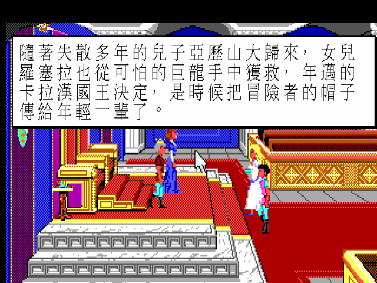
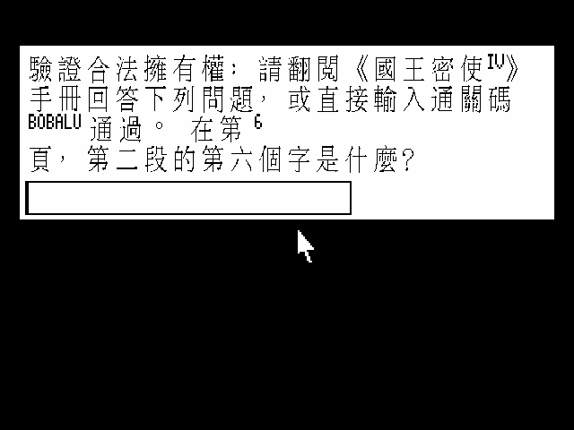

# 國王密使 IV：羅塞拉的冒險 — 繁體中文化

> King's Quest IV: The Perils of Rosella（1988, Sierra On-Line）SCI0 EGA 版
> ScummVM 繁體中文化 — patch-only

在達文奇的王座廳裡，年邁的卡拉漢國王倒下了。女兒羅塞拉望著鏡中的仙女，即將踏上一場只有一天一夜的冒險——這是 1988 年 Roberta Williams 親手設計、Sierra 第一款 SCI 引擎作品，也是電腦遊戲史上第一位女主角的冒險。本專案讓這則西方童話，說回熟悉的中文。

---

## 這是什麼

- 把《國王密使 IV》SCI0 EGA 版**全部遊戲文字**（敘述、對白、選單、系統訊息）繁體中文化，跑在現代 ScummVM 上。
- **畫面放大到 640×400 hi-res**：中文以 32×28 Big5 字模直繪 display buffer，筆畫銳利，不是把 320×200 硬放大的馬賽克。
- **僅發佈 ScummVM patch**（引擎改動 + 中文資料）。不含遊戲原始資源——你需自備遊戲檔。
- 音樂預設可用 **Roland MT-32**（自備 ROM，遠優於 AdLib）。

## 畫面

| 中文開場敘述 | 中文防拷驗證 |
|---|---|
|  |  |
| 王座廳，卡拉漢國王傳承冒險者之帽 | 防拷已附萬用通關碼 `BOBALU` |

## 特色

- **權威譯名**：人名地名採當年智冠／軟體世界中文說明書定名——羅塞拉、卡拉漢國王、蘭妮絲王后、仙女吉妮絲、反派樂樂蒂、塔米亞大陸、達文奇王國。玩起來就是記憶中那一版。
- **童話奇幻語感**：敘述流暢帶古典童話質感，對白自然口語、各角色語氣分明。
- **hi-res 銳利中文**：640×400 直繪，遠看近看都清楚。
- **防拷友善**：KQ4 開場要翻手冊答題。中文版提示已附上萬用通關碼 **`BOBALU`**——任何問題直接輸入即可通過，不必翻手冊。
- **完整覆蓋**：主線對白、parser 回應、道具互動、選單、credits、暫停畫面全中文（狀態列分數列因引擎限制保留英文）。

## 安裝與遊玩

需要：
1. 一份《King's Quest IV》**SCI 版**遊戲檔（含 `RESOURCE.MAP` / `RESOURCE.001`~`009`）。⚠ 此遊戲當年同時發行 AGI 與 SCI 兩版，本中文化針對 **SCI 版**。
2. 套用本專案的 ScummVM 引擎 patch（見 [`BUILD.md`](BUILD.md)），或使用完整包（若有提供）。

步驟（簡述，詳見 BUILD.md）：
1. 取乾淨 ScummVM 原始碼（pinned commit 見 `patches/UPSTREAM_COMMIT.txt`），套 `patches/0001-sci-cht-zh_twn.patch` + 複製 `patches/fontchinese.{h,cpp}`，編譯。
2. 把 `dist-cht/` 的 `translation.tsv`、`qfg1_big5.fnt`、`qfg1_big5_hi.fnt` 放進遊戲資料夾。
3. 在 ScummVM 加入遊戲，語言設為 `Chinese (Traditional)`（或 CLI `--language=tw`）啟動。

### 防拷通關

開場會出現「請翻閱手冊回答問題」的驗證框。中文版提示已寫明：**直接輸入 `BOBALU` 按 Enter 即可通過**（大小寫皆可）。

### Roland MT-32 音樂（建議）

老 Sierra 遊戲為 MT-32 譜曲，音色遠勝 AdLib。自備 MT-32 ROM（`MT32_CONTROL.ROM` + `MT32_PCM.ROM`）放進遊戲資料夾，音效選項選 Roland MT-32 即可。（ROM 有版權，不隨本專案發佈。）

## 中文手冊要點索引

當年智冠／軟體世界中文說明書掃描與重點整理見 [`docs/manual-cht.md`](docs/manual-cht.md)：

- **背景故事**：達文奇王國的傳承、三大寶物、卡拉漢與蘭妮絲、雙胞胎亞歷山大與羅塞拉。
- **本集劇情**：卡拉漢病倒，羅塞拉受仙女吉妮絲之託前往塔米亞，一日內取回護身符、尋找魔法果實，對抗邪惡仙女樂樂蒂。
- **操作**：鍵盤打指令（動詞＋名詞）、選單、存讀檔。
- **提示**：新手冒險守則、動詞表、走法攻略要點。

## 技術文件

- [`BUILD.md`](BUILD.md) — 三平台（Linux／Windows／macOS）重建 patched ScummVM
- [`docs/`](docs/) — 可行性、引擎 CJK patch、文字管線、方法論
- [`CONTEXT.md`](CONTEXT.md) / [`WORKLIST.md`](WORKLIST.md) — 專案脈絡與里程碑

## 致敬

原作 © 1988 Sierra On-Line。設計／監製 Roberta Williams。中文說明書定名承襲當年智冠科技／軟體世界。本專案為非商業之文化保存與致敬，不含亦不散佈任何遊戲原始資源。
